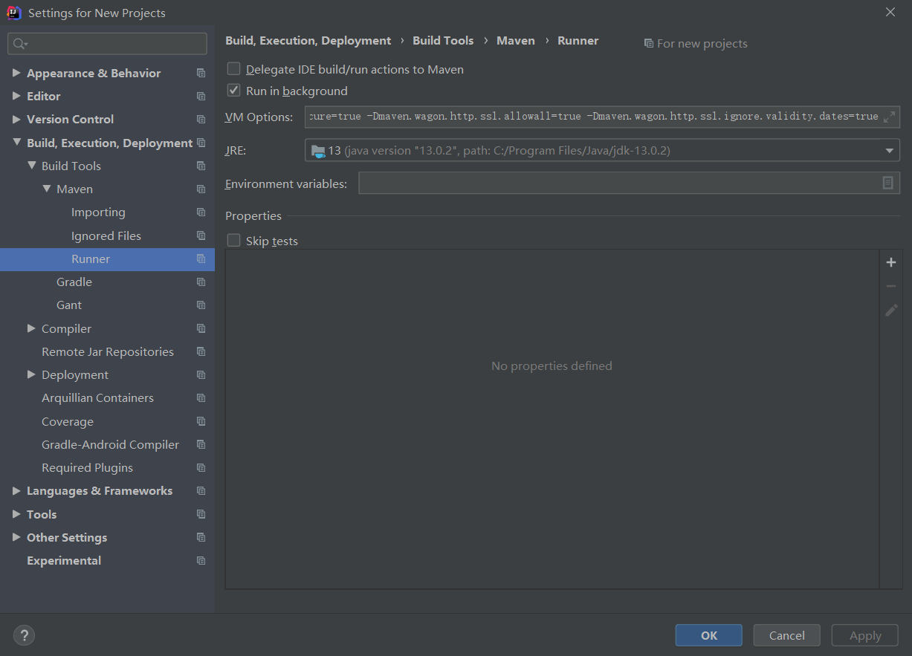

## 开始一个新的Spring项目

### 需要的工具

- IDEA2019.3.2   
- apache-maven-3.6.3  （解压后请在主目录创建一个 repository 的目录
- spring-5.2.7.RELEASE

安装请傻瓜式安装，下边开始新建一个Spring项目。

### idea的配置

建议同步到settings

1. File -> other settings -> Buile,Execution, Deployment -> maven

   

2. File -> other settings -> Buile,Execution, Deployment -> maven -> import

   - 注意把 *Import Maven projects automatically* 打勾

   - VM options for importer

     ```
     -Dmaven.wagon.http.ssl.insecure=true -Dmaven.wagon.http.ssl.allowall=true
     ```

     

   

3. File -> other settings -> Buile,Execution, Deployment -> maven -> runner

   VM Options

   ```
   -Dmaven.wagon.http.ssl.insecure=true -Dmaven.wagon.http.ssl.allowall=true -Dmaven.wagon.http.ssl.ignore.validity.dates=true
   ```

   

### 新建一个Spring项目

1. new Project 选择如下

   

2. 可以自行修改项目名字，位置，GroupId, ArtifactId

   

3. 配置`maven home directory`, `settings file`, `local repository`

   - *maven home diretory*是*apache-maven*的主目录
   - *settings file* 配置为*apache-maven*主目录下的*conf/settings.xml*,默认会为用户家目录`~/.m2/setting`
   - *local repository*则是maven仓库的位置, 这个仓库一开始是空的, 但会随着项目的创建而主动往里添加各种包和依赖, 默认在用户家目录`~/.m2/repository`

   

4. 如果是第一次创建maven项目,则需要进去后等等,知道`pom.xml`文件被重写且项目有基本文件结构.

   

5.  修改`pom.xml` 

   - 修改java版本 默认为1.7  (我正在用java13

     ```xml 
       <properties>
         <project.build.sourceEncoding>UTF-8</project.build.sourceEncoding>
         <maven.compiler.source>13</maven.compiler.source>
         <maven.compiler.target>13</maven.compiler.target>
       </properties>
     ```

   - 添加spring依赖  (我正在用的version为5.2.7 格式可上**mvnrepository.com**查询/进去直接搜spring.  修改完后相应的External Libraries会自动导入依赖

     ```xml
         <dependency>
           <groupId>org.springframework</groupId>
           <artifactId>spring-context</artifactId>
           <version>5.2.7.RELEASE</version>
         </dependency>
     ```

     

6. 在项目`src/main`下新建目录`resourcces`并右键把它标记为`resource root`.并在该目录下创建xml配置文件,改文件名可随意, 格式如下, 其中bean标签是需要我们写的内容

   ```xml
   
   <?xml version="1.0" encoding="UTF-8"?>
   <beans xmlns="http://www.springframework.org/schema/beans"
       xmlns:xsi="http://www.w3.org/2001/XMLSchema-instance"
       xsi:schemaLocation="http://www.springframework.org/schema/beans
           https://www.springframework.org/schema/beans/spring-beans.xsd">
   
       <bean id="..." class="...">  
           <!-- collaborators and configuration for this bean go here -->
       </bean>
   
       <bean id="..." class="...">
           <!-- collaborators and configuration for this bean go here -->
       </bean>
   
       <!-- more bean definitions go here -->
   
   </beans>
   
   
   ```

7. 任意新建一个包,新建一个类

   

8. 在第六步配置文件中的bean标签中添加该类

   ```
   <bean id="user" class="com.flyingdigital.hello.HelloWorld"></bean>
   ```

9. 测试

   ```
   package com.flyingdigital;
   
   import com.flyingdigital.hello.HelloWorld;
   import org.springframework.context.ApplicationContext;
   import org.springframework.context.support.ClassPathXmlApplicationContext;
   
   /**
    * Hello world!
    *
    */
   public class App 
   {
       public static void main( String[] args )
       {
           // 获取上下文环境 其中 ApplicationContext 是一个接口 ClassPathXmlApplicationContext 是一个具体的类
           ApplicationContext ac = new ClassPathXmlApplicationContext("spring.xml");
           // getBean 传入的参数是配置文件里的id 该函数返回类型是Object  需要强转
           HelloWorld hello = (HelloWorld) ac.getBean("hello");
           hello.hello();
       }
   
   }
   
   ```

   

